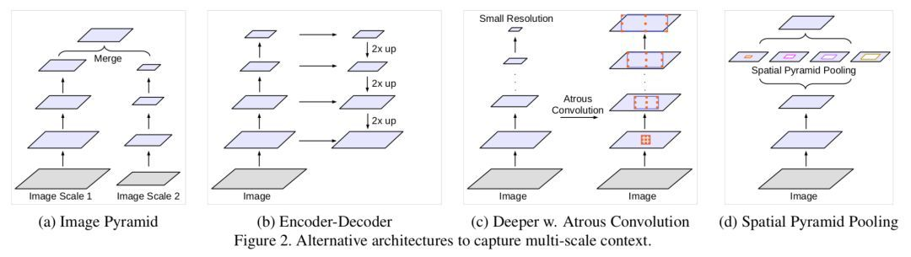
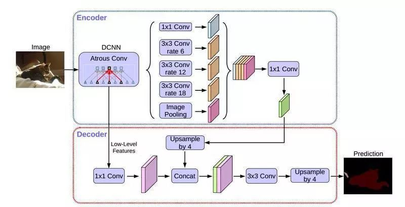
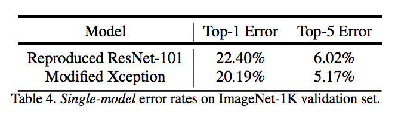
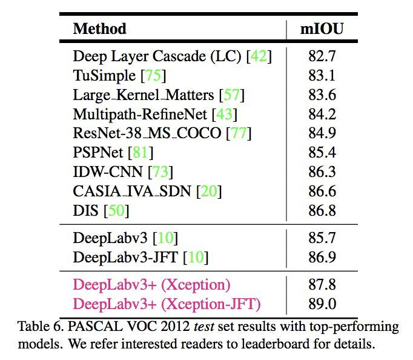

* content
{:toc}

## LeNet 网络结构

## 论文 | Encoder-Decoder with Atrous Separable Convolution for Semantic Image Segmentation

前言

临近春节，Google 团队也不休假，趁着中国人每年一度大迁徙，他们在 arXiv 放出了 DeepLabv3+，在语义分割领域取得新的 
state-of-the-art 水平。本文将带大家回顾 DeepLabv1-v4 系列的发展历程，看看 Google 团队这些年都在做什么。

DeepLabv1

DeepLab 是结合了深度卷积神经网络（DCNNs）和概率图模型（DenseCRFs）的方法。

在实验中发现 DCNNs 做语义分割时精准度不够的问题，根本原因是 DCNNs 的高级特征的平移不变性，即高层次特征映射，根源于重复的池化和下采样。

针对信号下采样或池化降低分辨率，DeepLab 是采用的 atrous（带孔）算法扩展感受野，获取更多的上下文信息。

分类器获取以对象中心的决策是需要空间变换的不变性，这天然地限制了 DCNN 的定位精度，DeepLab 采用完全连接的条件随机场（CRF）
提高模型捕获细节的能力。

除空洞卷积和 CRFs 之外，论文使用的 tricks 还有 Multi-Scale features。其实就是 U-Net 和 FPN 的思想，在输入图像和前四个最大
池化层的输出上附加了两层的 MLP，第一层是 128 个 3×3 卷积，第二层是 128 个 1×1 卷积。最终输出的特征与主干网的最后一层特征图
融合，特征图增加 5×128=640 个通道。

实验表示多尺度有助于提升预测结果，但是效果不如 CRF 明显。

论文模型基于 VGG16，在 Titan GPU 上运行速度达到了 8FPS，全连接 CRF 平均推断需要 0.5s ，在 PASCAL VOC-2012 达到 71.6% IOU accuracy。

DeepLabv2

DeepLabv2 是相对于 DeepLabv1 基础上的优化。DeepLabv1 在三个方向努力解决，但是问题依然存在：特征分辨率的降低、
物体存在多尺度，DCNN 的平移不变性。

因 DCNN 连续池化和下采样造成分辨率降低，DeepLabv2 在最后几个最大池化层中去除下采样，取而代之的是使用空洞卷积，
以更高的采样密度计算特征映射。

物体存在多尺度的问题，DeepLabv1 中是用多个 MLP 结合多尺度特征解决，虽然可以提供系统的性能，但是增加特征计算量和存储空间。

论文受到 Spatial Pyramid Pooling (SPP) 的启发，提出了一个类似的结构，在给定的输入上以不同采样率的空洞卷积并行采样，
相当于以多个比例捕捉图像的上下文，称为 ASPP (atrous spatial pyramid pooling) 模块。

DCNN 的分类不变形影响空间精度。DeepLabv2 是采样全连接的 CRF 在增强模型捕捉细节的能力。

论文模型基于 ResNet，在 NVidia Titan X GPU 上运行速度达到了 8FPS，全连接 CRF 平均推断需要 0.5s ，在耗时方面和 DeepLabv1 无差异，
但在 PASCAL VOC-2012 达到 79.7 mIOU。

DeepLabv3

好的论文不止说明怎么做，还告诉为什么。DeepLab 延续到 DeepLabv3 系列，依然是在空洞卷积做文章，但是探讨不同结构的方向。

DeepLabv3 论文比较了多种捕获多尺度信息的方式：

1. Image Pyramid：将输入图片放缩成不同比例，分别应用在 DCNN 上，将预测结果融合得到最终输出。

2. Encoder-Decoder：利用 Encoder 阶段的多尺度特征，运用到 Decoder 阶段上恢复空间分辨率，代表工作有 FCN、SegNet、PSPNet 等工。

3. Deeper w. Atrous Convolution：在原始模型的顶端增加额外的模块，例如 DenseCRF，捕捉像素间长距离信息。

4. Spatial Pyramid Pooling：空间金字塔池化具有不同采样率和多种视野的卷积核，能够以多尺度捕捉对象。

DeepLabv1-v2 都是使用带孔卷积提取密集特征来进行语义分割。但是为了解决分割对象的多尺度问题，DeepLabv3 设计采用多比例的带孔卷积级联或
并行来捕获多尺度背景。

此外，DeepLabv3 将修改之前提出的带孔空间金字塔池化模块，该模块用于探索多尺度卷积特征，将全局背景基于图像层次进行编码获得特征，取得 
state-of-art 性能，在 PASCAL VOC-2012 达到 86.9 mIOU。

DeepLabv3+

DeepLabv3+ 架构

DeepLabv3+ 继续在模型的架构上作文章，为了融合多尺度信息，引入语义分割常用的 encoder-decoder。在 encoder-decoder 架构中，引入可
任意控制编码器提取特征的分辨率，通过空洞卷积平衡精度和耗时。

在语义分割任务中采用 Xception 模型，在 ASPP 和解码模块使用 depthwise separable convolution，提高编码器-解码器网络的运行速率和
健壮性，在 PASCAL VOC 2012 数据集上取得新的 state-of-art 表现，89.0 mIOU。

Xception 改进

Entry flow 保持不变，但是添加了更多的 Middle flow。所有的 max pooling 被 depthwise separable convolutions 替代。
在每个 3x3 depthwise convolution 之外，增加了 batch normalization 和 ReLU。

实验

论文提出的模型在主干网络 ResNet-101 和 Xception均进行验证。两种方式均在 ImageNet 预训练。其中 Xception 预训练过程中，
使用 50 个 GPU，每个 GPU batch size=32，分辨率 299x299。Xception 相比 ResNet-101，在 Top-1 和 Top-5 分别提高 0.75% 和 0.29%。

在实验过程中，分别考虑 train OS: The output stride used during training、eval OS: The output stride used during 
evaluation、Decoder: Employing the proposed decoder structure、MS: Multi-scale inputs during evaluation、 
Flip: Adding left-right flipped inputs 等各种情况。

另外使用 depthwise separable convolution，使用 Pretraining on COCO 和 Pretraining on JFT，在这些 tricks 辅助下，
PASCAL VOC 2012 test set 达到惊人的 89.0%，取得新的 state-of-the-art 水平。

结论

从 DeepLabv1-v4 系列看，空洞卷积必不可少。从 DeepLabv3 开始去掉 CRFs。

Github 目前还未有公布的 DeepLabv3，但是有网友的复现版本。DeepLabv3+ 更是没有源代码，复现起来估计有些难度。

DeepLabv3 复现：

https://github.com/NanqingD/DeepLabV3-Tensorflow

DeepLabv1-v4 没有用很多 tricks，都是从网络架构中调整，主要是如何结合多尺度信息和空洞卷积。从FCN，ASPP，Encoder-Decoder 
with Atrous Conv，每一个想法看上去在别的都实现过，但是论文综合起来就是有效。

Deeplabv1，v2 耗时为 8fps，从 Deeplabv3 开始，论文已经不说运行时间的问题，是否模型越来越慢了。

MobileNetV2 已经实现 Deeplabv3，并努力在 MobileNetV2 中复现 DeepLabv3+ 版本。

参考文献

[1] Semantic image segmentation with deep convolutional nets and fully connected CRFs.

[2] DeepLab: Semantic Image Segmentation with Deep Convolutional Nets, Atrous Convolution, and Fully Connected CRFs.

[3] Rethinking Atrous Convolution for Semantic Image Segmentation.

[4] Encoder-Decoder with Atrous Separable Convolution for Semantic Image Segmentation.
