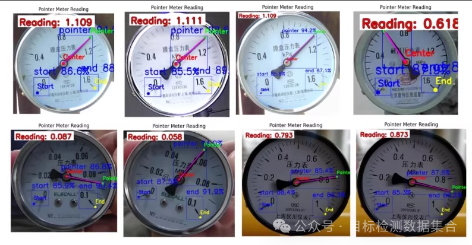
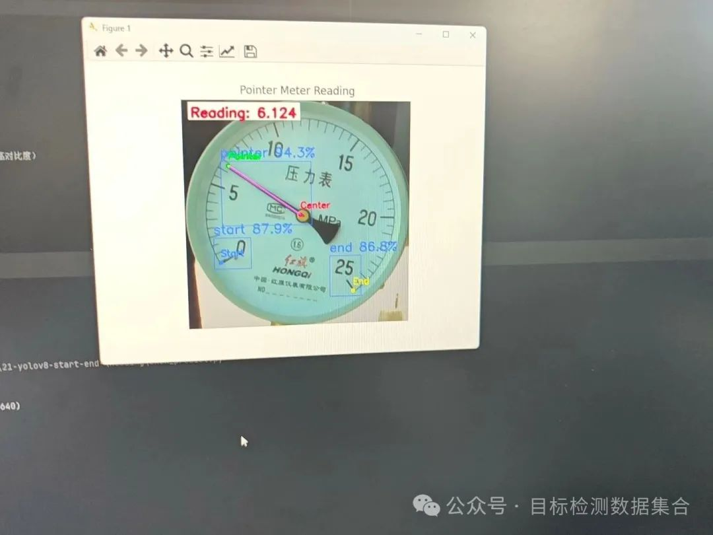

* content
{:toc}


基于yolov8-pose数据集上进行训练仪器仪表读数检测数据集 关键点为指针端点，表盘中心，刻度盘起点和终点 仪表读数检测识别

yolov8-pose 关键点检测的指针式仪表读数算法，提供训练，提供测试和训练过程图
一，基于 yolov8-pose 在自建数据集上进行训练
二，识别关键点为指针端点，表盘中心，刻度盘起点和终点
三，识别到 4 个关键点结果，基于角度法完成读数任务，进行高精度读表；

基于yolov8-pose在自建数据集上进行训练 关键点为指针端点，表盘中心，刻度盘起点和终点

##### 描述：
基于yolov8-pose在自建数据集上进行训练
✔识别关键点为指针端点，表盘中心，刻度盘起点和终点
✔根据上述识别到4个关键点结果，基于角度法完成读数任务，进行高精度读表；



使用 **YOLOv8-Pose** 在自建数据集上进行指针仪表的读数任务，我们需要完成以下几个步骤：环境搭建、数据准备、模型训练、关键点识别、基于角度计算的读数任务。下面将详细介绍这些步骤，代码示例，仅供参考学习


###### 完整代码 `meter_predict.py`

```python
from ultralytics import YOLO
import cv2
import math

model = YOLO('best.pt')
objs_labels = model.names

# 在图片列表上运行批量推理
results = model(["../datas/test_data/roi_image_0_20240712105258.jpg"], save=False, imgsz=640)

frame = cv2.imread("../datas/test_data/roi_image_0_20240712105258.jpg")
frame = cv2.cvtColor(frame, cv2.COLOR_BGR2RGB)

# 定义颜色常量
RED =(255,0,0)# 红色
GREEN =(0,255,0)# 绿色
BLUE =(0,0,255)# 蓝色
PURPLE =(255,0,255)# 紫色
YELLOW =(255,255,0)# 黄色

# 存储各类别的关键点
pointer_keypoints =None
start_keypoints =None
end_keypoints =None

# 设置实际量程
actual_range =0.1# 修改为您的实际量程（例如：0-100）

defcalculate_angle(point1, point2):
"""计算两点间的角度"""
    x1, y1 = point1
    x2, y2 = point2
    angle = math.atan2(y2 - y1, x2 - x1)*(180/ math.pi)
if angle <0:
        angle +=360
return angle

defread_meter(pointer_end, dial_center, scale_start, scale_end, actual_range):
"""基于关键点位置读取表盘数值"""

# 计算指针相对于表盘中心的角度
    angle_pointer = calculate_angle(dial_center[:2], pointer_end[:2])
    angle_scale_start = calculate_angle(dial_center[:2], scale_start[:2])
    angle_scale_end = calculate_angle(dial_center[:2], scale_end[:2])

# 假设刻度范围是0到100
    max_value = actual_range
    min_value =0

# 计算比例因子
    total_degrees =abs(angle_scale_start - angle_scale_end)
    value_per_degree =(max_value - min_value)/ total_degrees

# 计算读数
if angle_pointer > angle_scale_start:
        reading =((angle_pointer - angle_scale_start)%360)* value_per_degree + min_value
else:
        reading =((angle_scale_start - angle_pointer)%360)* value_per_degree + min_value

# 归一化读数到实际值域
if reading > max_value:
        reading -= max_value

return reading

for result in results:
for box in result.boxes:
        cls_id =int(box.cls[0])
        label = objs_labels[cls_id]

        keypoints = result.keypoints[0].cpu().numpy()

if label =='pointer_end':
            pointer_keypoints = keypoints
elif label =='scale_start':
            start_keypoints = keypoints
elif label =='scale_end':
            end_keypoints = keypoints

if pointer_keypoints isnotNoneand start_keypoints isnotNoneand end_keypoints isnotNone:
    reading = read_meter(
        pointer_keypoints,
[frame.shape[1]//2, frame.shape[0]//2],# 假设表盘中心在图像中心
        start_keypoints,
        end_keypoints,
        actual_range
)
print(f"读数结果: {reading}")
else:
print("未找到所有关键点")

# 显示图像
cv2.imshow("Frame", frame)
cv2.waitKey(0)
cv2.destroyAllWindows()
```




1. 关键点标签

   ：确保数据集标注中，`pointer_end`, `scale_start`, `scale_end` 的标签与模型训练时一致。

2. 表盘中心

   ：上述代码假设表盘中心位于图像中心，如果实际情况不同，请调整 `dial_center` 参数。

3. 实际量程

   ：根据你的仪表实际量程调整 `actual_range` 变量。

4. 路径配置

   ：根据你的项目目录结构调整图片路径。

#### 数据准备

假设你的数据集已经标注好，并且包含以下四个关键点：

- 指针端点
- 表盘中心
- 刻度盘起点
- 刻度盘终点

数据目录结构示例如下：

```
meter_dataset/
├── images/
│   ├── train/
│   └── val/
├── labels/
│   ├── train/
│   └── val/
└── data.yaml       # 数据配置文件
```

`data.yaml` 示例：

```
train: ./meter_dataset/images/train
val: ./meter_dataset/images/val

nc:4# 关键点数量
names:['pointer_end','dial_center','scale_start','scale_end']
```


#### 训练 YOLOv8-Pose 模型

由于 YOLOv8-Pose 主要用于人体姿态估计，这里我们调整其用于仪表的关键点检测。首先加载预训练模型并进行微调。

```python
from ultralytics import YOLO

# 加载官方预训练模型（可能需要根据实际情况选择合适的模型）
model = YOLO('yolov8-pose.pt')# 或者使用 yolov8m-pose.pt 以获得更好的性能

# 开始训练
results = model.train(
    data='data.yaml',
    epochs=200,# 根据数据量调整
    batch=16,# 根据显存调整
    imgsz=640,
    optimizer='AdamW',
    lr0=0.001,
    augment=True,
    project='runs/train',
    name='meter_reading_pose'
)
```

### 关键点识别与读数任务

在完成训练后，我们可以利用模型预测结果来计算指针的角度，并据此读取表盘上的数值。

#### 推理代码示例

```python
import cv2
import math
import numpy as np

defcalculate_angle(point1, point2):
"""计算两点间的角度"""
    x1, y1 = point1
    x2, y2 = point2
    angle = math.atan2(y2 - y1, x2 - x1)*(180/ math.pi)
if angle <0:
        angle +=360
return angle

defread_meter(predictions):
"""基于关键点位置读取表盘数值"""
    pointer_end =None
    dial_center =None
    scale_start =None
    scale_end =None

for pred in predictions:
if pred['label']=='pointer_end':
            pointer_end = pred['keypoints']
elif pred['label']=='dial_center':
            dial_center = pred['keypoints']
elif pred['label']=='scale_start':
            scale_start = pred['keypoints']
elif pred['label']=='scale_end':
            scale_end = pred['keypoints']

ifnotall([pointer_end, dial_center, scale_start, scale_end]):
raise ValueError("未找到所有关键点")

# 计算指针相对于表盘中心的角度
    angle_pointer = calculate_angle(dial_center[:2], pointer_end[:2])
    angle_scale_start = calculate_angle(dial_center[:2], scale_start[:2])
    angle_scale_end = calculate_angle(dial_center[:2], scale_end[:2])

# 假设刻度范围是0到100
    max_value =100
    min_value =0

# 计算比例因子
    total_degrees =abs(angle_scale_start - angle_scale_end)
    value_per_degree =(max_value - min_value)/ total_degrees

# 计算读数
if angle_pointer > angle_scale_start:
        reading =((angle_pointer - angle_scale_start)%360)* value_per_degree + min_value
else:
        reading =((angle_scale_start - angle_pointer)%360)* value_per_degree + min_value

# 归一化读数到实际值域
if reading > max_value:
        reading -= max_value

return reading

# 加载最佳模型
model = YOLO('runs/train/meter_reading_pose/weights/best.pt')

# 推理
results = model.predict(source='test_image.jpg', conf=0.5)

# 获取预测结果
predictions = results[0].keypoints  # 假设返回的是关键点坐标

# 执行读数任务
reading = read_meter(predictions)
print(f"读数结果: {reading}")
```

